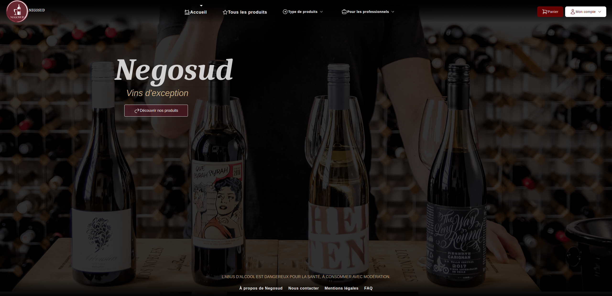
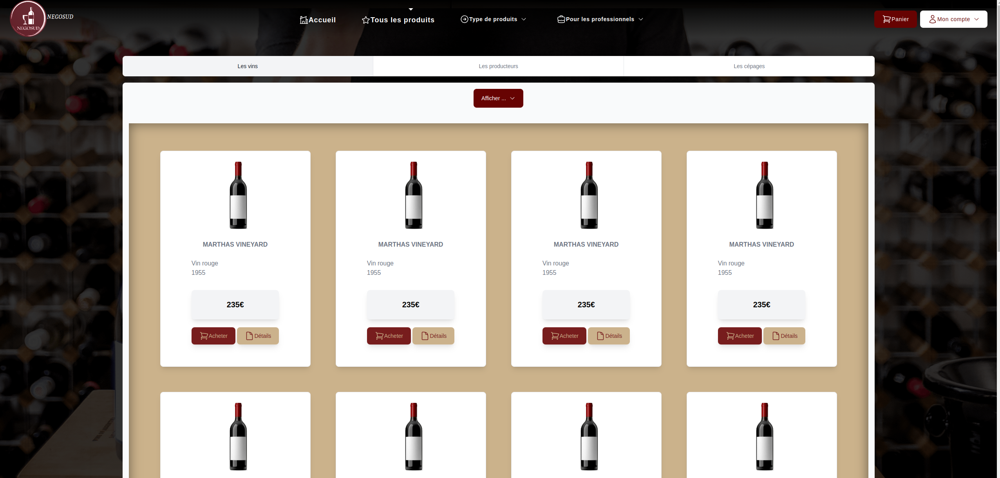

# Negosud Web

### *Site e-commerce du négociant en vin NEGOSUD*

---

## Stack technique


- **NodeJS ^18.13.0**


- **NPM ^8.19.3**


- **SvelteKit ^1.0.0**


- **Tailwind CSS ^2.2.19**


- **TypeScript ^4.9.3**


---

## Installation


```bash
git clone <repo>
```

```bash
npm install
```

```bash
npm run dev || npm run build
```

**_Le site est disponible sur le port 5173 !_**

---
## Présentation

Ce site est un site e-commerce de vente de vin. Il est développé en SvelteKit, un framework de développement web basé sur Svelte, un framework JavaScript qui permet de développer des applications web réactives.

**Fonctionnalités :**

    
- Authentification


- Gestion des comptes clients


- Gestion de paniers


- Gestion des commandes


### Page d'accueil :



### Liste des produits :


